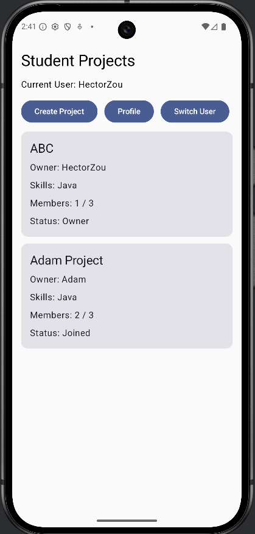
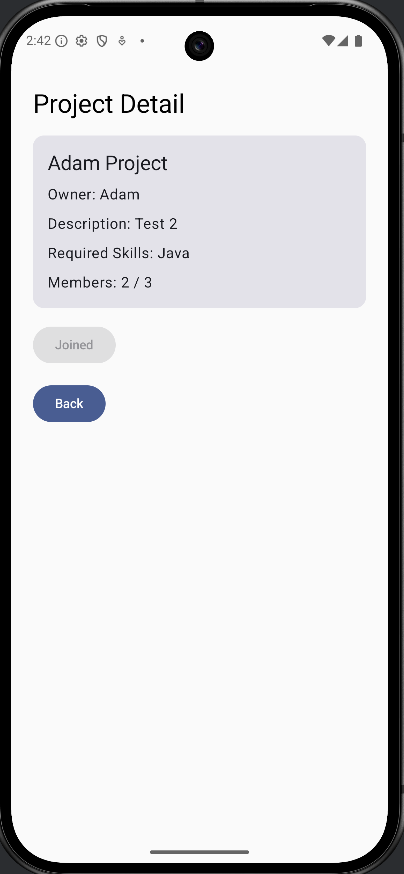
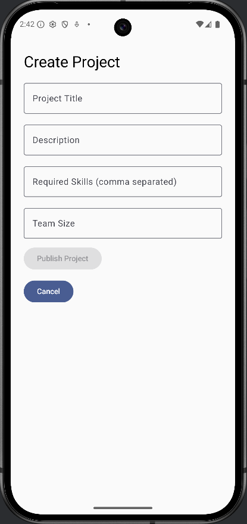
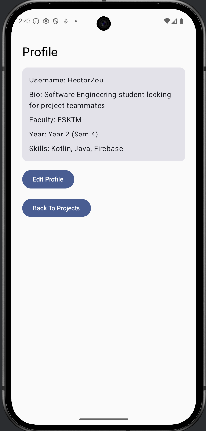
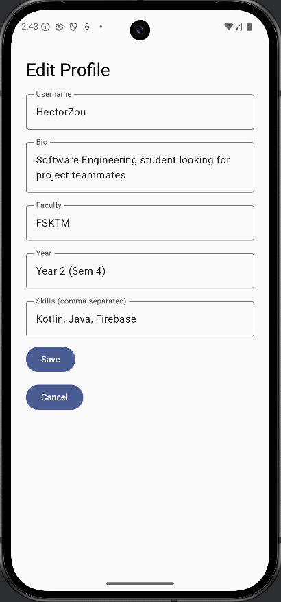
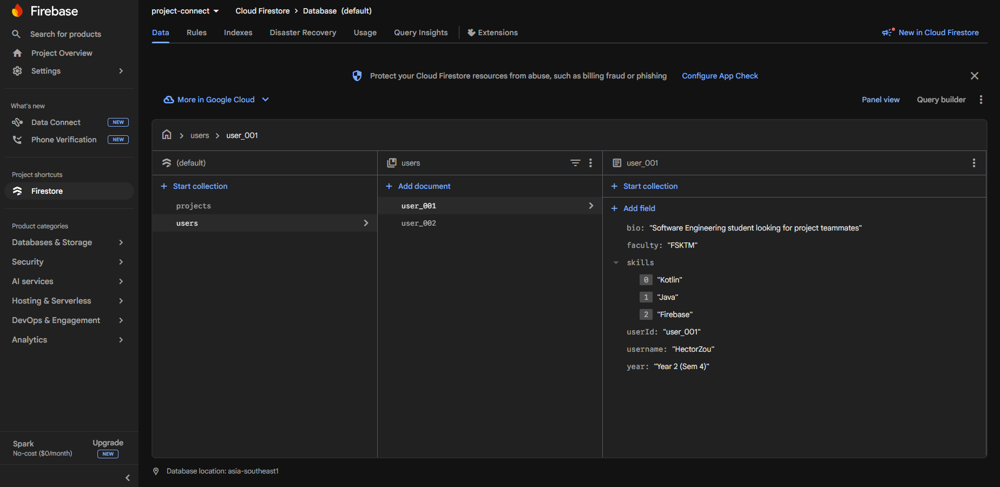
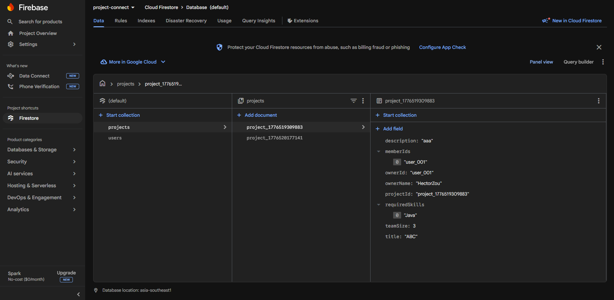

# Project Connect

Project Connect is an Android mobile application that helps students create projects, join projects, and manage their profiles in a simple collaboration platform.

This project is built using Kotlin, Jetpack Compose, and Firebase Firestore.

---

## Features

- View student projects
- Create a new project
- Join an existing project
- Delete owned projects
- View and edit user profile
- Store user and project data in Firebase Firestore
- Real-time project list updates
- Switch between test users for easier feature testing

---

## Tech Stack

- **Language:** Kotlin
- **UI:** Jetpack Compose
- **Backend / Database:** Firebase Firestore
- **IDE:** Android Studio
- **Version Control:** Git and GitHub

---

## Current Modules

### 1. Profile Management
Users can view and edit their profile details, including:
- username
- bio
- faculty
- year
- skills

Profile data is stored in Firebase Firestore.

### 2. Project Discovery
Users can browse available student projects from the home screen.

Each project shows:
- project title
- owner name
- required skills
- current member count
- project status

### 3. Project Creation
Users can create a new project by entering:
- title
- description
- required skills
- team size

The project is saved to Firebase Firestore and automatically appears in the project list.

### 4. Project Joining
Users can join a project if:
- they are not the owner
- they have not already joined
- the project is not full

### 5. Project Deletion
Project owners can delete their own projects.

Deleted projects are removed from Firebase Firestore and automatically disappear from the project list.

### 6. Real-Time Updates
The project list updates automatically when project data changes in Firestore.

---

## Screenshots

### Home / Project List


### Project Detail


### Create Project


### Profile Page


### Edit Profile


### Firestore User Data


### Firestore Project Data


---

## Firebase Setup

This project uses Firebase Firestore.

### Required Setup
1. Create a Firebase project
2. Add an Android app with this package name:
   `com.example.projectconnect`
3. Download `google-services.json`
4. Place it inside the `app/` folder
5. Enable Firestore Database in Firebase Console

> `google-services.json` is ignored in Git and is not included in this repository.

---

## How to Run

1. Clone this repository
2. Open it in Android Studio
3. Add your own `google-services.json` file into the `app/` folder
4. Sync Gradle
5. Run the app on an emulator or Android device

---

## Project Structure

```text
app/src/main/java/com/example/projectconnect
├─ data
│  ├─ model
│  └─ repository
├─ navigation
├─ ui
│  ├─ component
│  ├─ screen
│  └─ theme
├─ viewmodel
└─ MainActivity.kt
```

---

## Example Test Flow

1. Open the app
2. Edit a user profile and save it
3. Create a new project
4. Return to the project list
5. Switch to another test user
6. Join the created project
7. Delete a project as the owner
8. Check Firestore to verify updated data

---

## Notes

-This version focuses on the core features
-Authentication and chat features are not included yet
-Firebase Firestore is used for both user profiles and project data
-The app currently uses test users for local feature testing

---

## Author

Developed as a mobile application project using Android Studio, Kotlin, Jetpack Compose, and Firebase Firestore.
